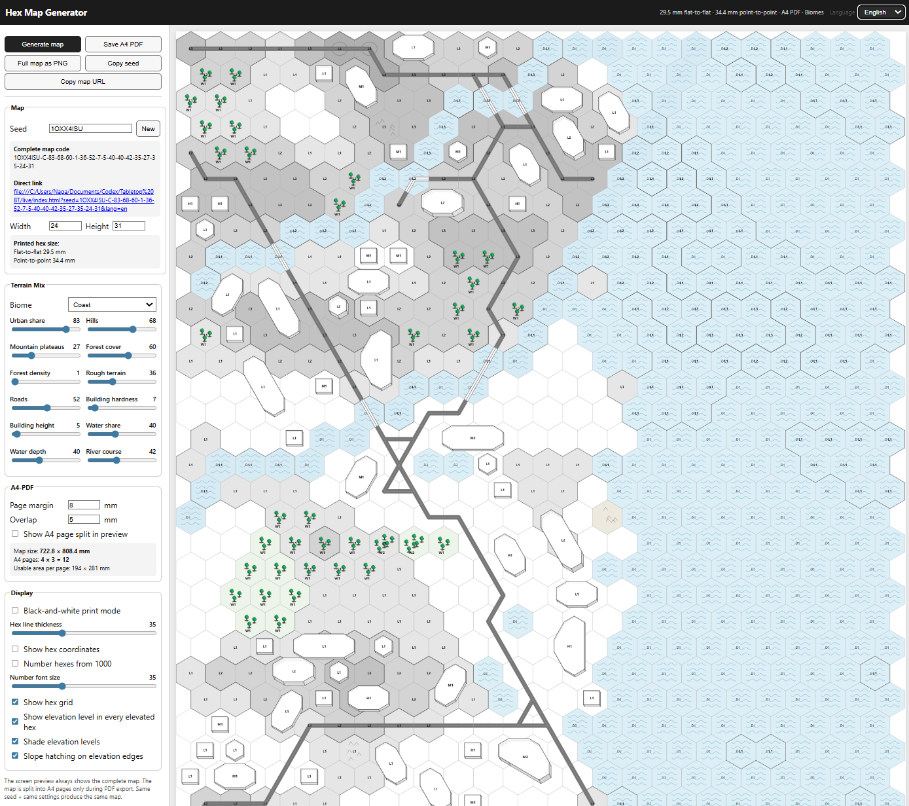
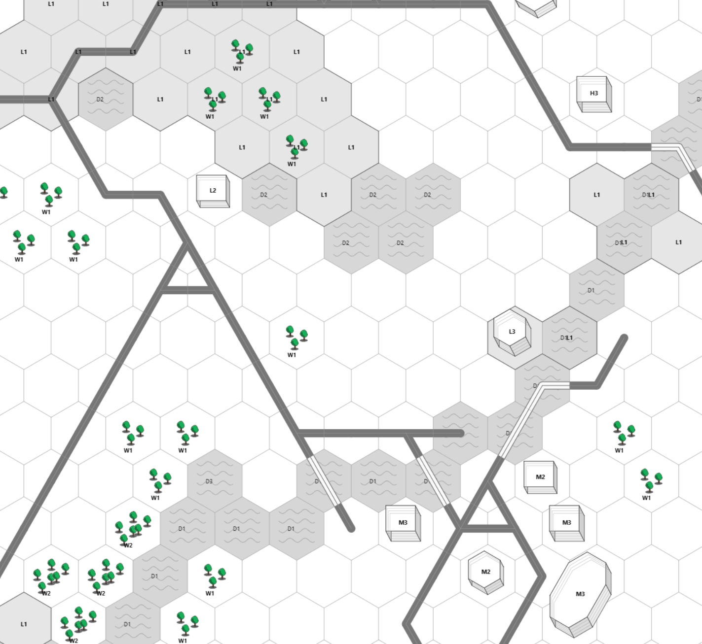

# Simple B&W Hex Map Editor

Version: 0.12.1

A standalone browser-based black-and-white hex map editor and generator for printable tabletop wargame maps.

The editor runs directly from `index.html`. No web server, build step, package manager, CDN, or internet connection is required.

## Preview

## Features

- Deterministic map generation from a seed
- German and English interface
- Several biome presets
- Adjustable terrain, roads, water, elevation, buildings, and display options
- Full-map PNG export
- Tiled A4 PDF export for printing
- Shareable map code and URL

## Run Locally

Open `index.html` in a modern browser.

Keep the `assets/` folder next to `index.html`; the editor loads local assets with relative paths.

## Deutsch

Ein eigenstaendiger, browserbasierter Schwarzweiss-Hexkarten-Editor und Generator fuer druckbare Tabletop-Karten.

Der Editor laeuft direkt aus `index.html`. Es werden kein Webserver, kein Build-Schritt, kein Package-Manager, kein CDN und keine Internetverbindung benoetigt.

## Funktionen

- Deterministische Kartenerzeugung ueber Seed
- Deutsche und englische Oberflaeche
- Mehrere Biom-Voreinstellungen
- Einstellbares Gelaende, Strassen, Wasser, Hoehen, Gebaeude und Darstellungsoptionen
- PNG-Export der Gesamtkarte
- A4-PDF-Export mit Seitenaufteilung fuer den Druck
- Teilbarer Karten-Code und teilbare Karten-URL

## Lokal Starten

`index.html` in einem modernen Browser oeffnen.

Der Ordner `assets/` muss neben `index.html` bleiben; der Editor laedt lokale Assets ueber relative Pfade.

## License

Licensed under the Apache License, Version 2.0. See `LICENSE` and `NOTICE`.
